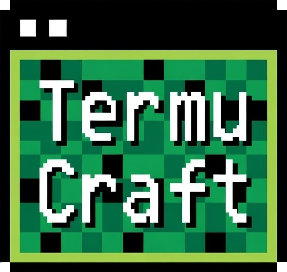

# TermuCraft

  

  A Minecraft server panel for Termux.

TermuCraft is a web-based Minecraft server panel built for running and managing servers directly from Android through Termux. The goal is to make mobile hosting practical, manageable, and less annoying than doing everything by hand.

## Status

TermuCraft is in early development.

This repository is the start of a separate project direction focused on a cleaner base, stronger feature coverage, and a more intentional roadmap.

## Main Idea

TermuCraft is meant to give you a proper control panel for a Minecraft server running in Termux, without treating Android hosting like a joke or a temporary hack.

Instead of relying on scattered shell commands, manual file edits, and constant guesswork, the panel is intended to handle the common server-management flow from one place.

## Core Features

- Browser-based control panel
- Start, stop, restart, and force-kill controls
- Live console output
- Server status and uptime tracking
- Server property editing
- File management for important config files
- Player actions and admin controls
- Backups and restore support
- Crash logging and auto-restart behavior
- Authentication for panel access
- Termux-first setup and hosting workflow

## Planned Server Management Scope

- Vanilla support
- Modded and alternative server support
- Version download and install flow
- Server JAR management
- Plugin and mod file handling
- Validation and environment checks
- Better install and update flow over time

## Why This Exists

Running a Minecraft server on Android is possible, but the tooling is usually rough, unfinished, or built like the platform does not matter.

TermuCraft exists to make that workflow feel more complete:

- better control
- cleaner setup
- less manual maintenance
- a UI that actually helps

## Design Direction

- Mobile-hosting focused
- Practical over bloated
- Built around Termux instead of treating it as an afterthought
- Intended to grow into a more feature-rich panel over time

## Tech Direction

The project is expected to stay lightweight and straightforward:

- HTML, CSS, and JavaScript for the frontend
- Node.js backend
- Termux-compatible workflow
- Local web panel access from the device or LAN

## Roadmap

- Build the first usable base release
- Recreate and improve the core management flow
- Expand server install support
- Improve reliability and recovery behavior
- Refine the interface and onboarding flow
- Reach a stable `v1.0` foundation before thinking about anything more ambitious

## Notes

- This project is separate from DroidMC
- The current focus is the free/base experience first
- The goal is to ship something solid before adding extra complexity

## Repository Setup

This repository is currently being set up, so structure, docs, and implementation details will continue to change while the project takes shape.
